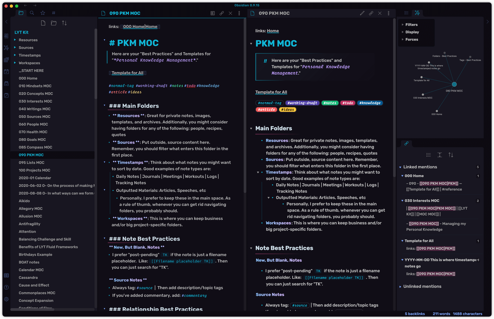
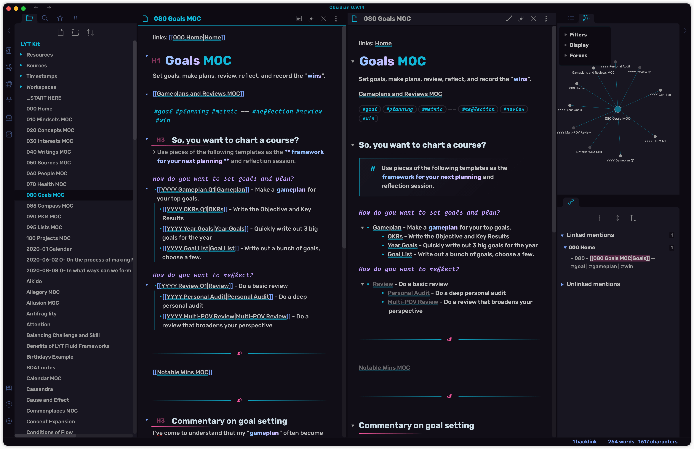
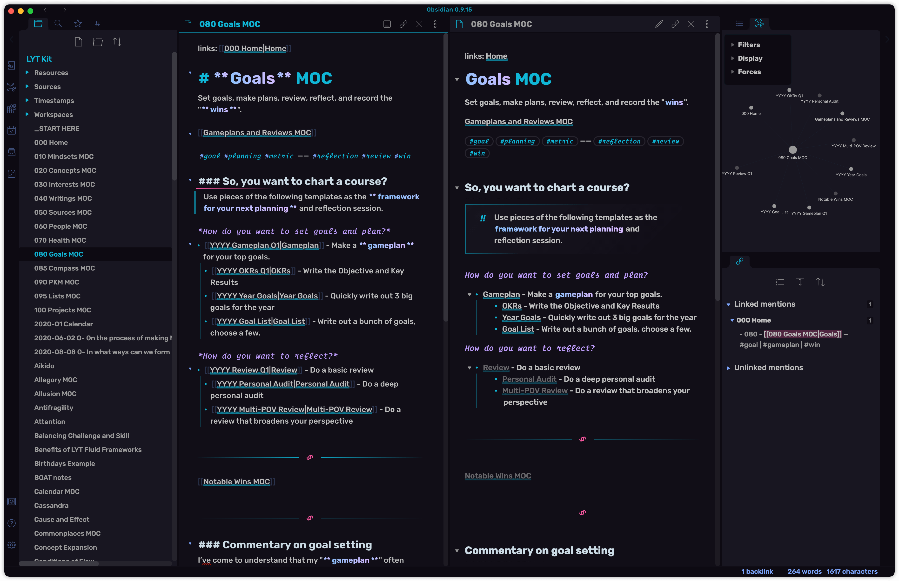

<p align="center"><a href="https://tridiamond.tech" target="_blank" rel="noopener noreferrer"></a></p>

<h1 align="center">Obsidian Theme: Obsidianite</h1>

<div align="center">

v1.x | Designed & Coded with 💎 by TriDiamond <br>
Obsidian.md custom theme, it's dark and simple but yet still stays sparkles!

  <p align="center">
    
    
    
  </p>

**[CHANGES](https://github.com/TriDiamond/Obsidian-Obsidianite/blob/main/CHANGELOG.md)**

</div>

```css
/** ---------------------------------------------------------------
**  ██████╗ ██████╗ ███████╗██╗██████╗ ██╗ █████╗ ███╗   ██╗██╗████████╗███████╗
** ██╔═══██╗██╔══██╗██╔════╝██║██╔══██╗██║██╔══██╗████╗  ██║██║╚══██╔══╝██╔════╝
** ██║   ██║██████╔╝███████╗██║██║  ██║██║███████║██╔██╗ ██║██║   ██║   █████╗
** ██║   ██║██╔══██╗╚════██║██║██║  ██║██║██╔══██║██║╚██╗██║██║   ██║   ██╔══╝
** ╚██████╔╝██████╔╝███████║██║██████╔╝██║██║  ██║██║ ╚████║██║   ██║   ███████╗
**  ╚═════╝ ╚═════╝ ╚══════╝╚═╝╚═════╝ ╚═╝╚═╝  ╚═╝╚═╝  ╚═══╝╚═╝   ╚═╝   ╚══════╝
**
**  —— Made with 💎 by TriDiamond
**  version 1.0.3
** --------------------------------------------------------------- */
```




