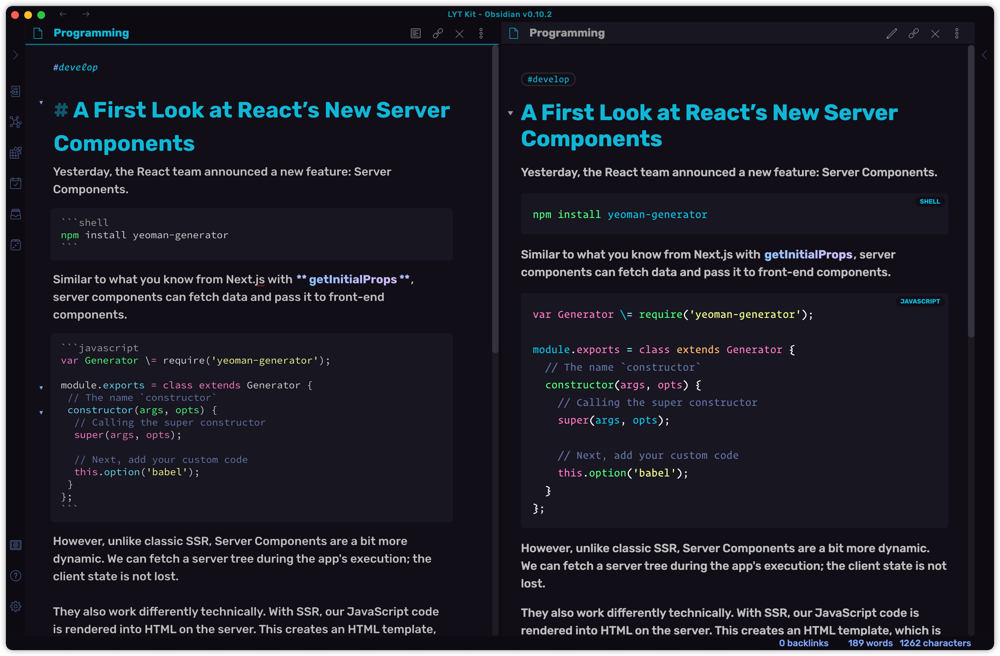

<p align="center"><a href="https://tridiamond.tech" target="_blank" rel="noopener noreferrer"></a></p>

<h1 align="center">Obsidian Theme: Obsidianite</h1>

<div align="center">

v1.x | Designed & Coded with 💎 by TriDiamond <br>
Obsidian.md custom theme, it's dark and simple but yet still stays sparkles!

  <p align="center">
    
    
    
  </p>

**[CHANGES](https://github.com/TriDiamond/Obsidian-Obsidianite/blob/main/CHANGELOG.md)**

</div>

```css
/** ---------------------------------------------------------------
**  ██████╗ ██████╗ ███████╗██╗██████╗ ██╗ █████╗ ███╗   ██╗██╗████████╗███████╗
** ██╔═══██╗██╔══██╗██╔════╝██║██╔══██╗██║██╔══██╗████╗  ██║██║╚══██╔══╝██╔════╝
** ██║   ██║██████╔╝███████╗██║██║  ██║██║███████║██╔██╗ ██║██║   ██║   █████╗
** ██║   ██║██╔══██╗╚════██║██║██║  ██║██║██╔══██║██║╚██╗██║██║   ██║   ██╔══╝
** ╚██████╔╝██████╔╝███████║██║██████╔╝██║██║  ██║██║ ╚████║██║   ██║   ███████╗
**  ╚═════╝ ╚═════╝ ╚══════╝╚═╝╚═════╝ ╚═╝╚═╝  ╚═╝╚═╝  ╚═══╝╚═╝   ╚═╝   ╚══════╝
**
**  —— Made with 💎 by TriDiamond
** --------------------------------------------------------------- */
```

## Screenshots




## Customizable Settings

```css
/******************************************
**  ██████╗██╗   ██╗███████╗████████╗ ██████╗ ███╗   ███╗██╗███████╗███████╗
** ██╔════╝██║   ██║██╔════╝╚══██╔══╝██╔═══██╗████╗ ████║██║╚══███╔╝██╔════╝
** ██║     ██║   ██║███████╗   ██║   ██║   ██║██╔████╔██║██║  ███╔╝ █████╗
** ██║     ██║   ██║╚════██║   ██║   ██║   ██║██║╚██╔╝██║██║ ███╔╝  ██╔══╝
** ╚██████╗╚██████╔╝███████║   ██║   ╚██████╔╝██║ ╚═╝ ██║██║███████╗███████╗
**  ╚═════╝ ╚═════╝ ╚══════╝   ╚═╝    ╚═════╝ ╚═╝     ╚═╝╚═╝╚══════╝╚══════╝
** —— You can customized the theme using the variables below
******************************************/

:root {
  /***************************************/
  /*    FONTS RELATED                    */
  /***************************************/

  /** Font Customization **/
  --default-font: 'Rubik', 'Glow Sans SC', 'Inter', -apple-system, BlinkMacSystemFont, 'Segoe UI', Roboto,
    Helvetica, Arial, sans-serif, 'Apple Color Emoji', 'Segoe UI Emoji', sans-serif;

  /** Main text font weight **/
  --body-font-weight: 450;

  /** Font family for hash-tags **/
  --tag-font-family: 'OperatorMonoSSmLig-Book', 'Glow Sans SC', '华文细黑', 'STXihei',
    'PingFang TC', '微软雅黑体', 'Microsoft YaHei New', '微软雅黑', 'Microsoft Yahei', '宋体',
    'SimSun', 'Helvetica Neue', 'Helvetica', Arial, sans-serif !important;
}

/**-------------------**
| CUSTOMIZED TAG COLOURS
**--------------------**/

/* For preview mode */
a.tag[href*='#todo'],
a.tag[href*='#待完成'] {
  background-color: #be2e5e;
  color: #fff;
}
/* For Editor Mode */
.cm-s-obsidian .CodeMirror-line span.cm-tag-todo:not(.cm-formatting-hashtag) {
  color: #ee6a96;
}

a.tag[href*='#working-draft'],
a.tag[href*='#进行中'] {
  background-color: #4d3ca6;
  color: #fff;
}

.cm-s-obsidian .CodeMirror-line span.cm-tag-working-draft:not(.cm-formatting-hashtag) {
  color: #a897ff;
}

a.tag[href*='#notes'],
a.tag[href*='#笔记'] {
  background-color: #17b978;
  color: #fff;
}

.cm-s-obsidian .CodeMirror-line span.cm-tag-notes:not(.cm-formatting-hashtag) {
  color: #45e0a2;
}

a.tag[href*='#knowledge'],
a.tag[href*='#知识'] {
  background-color: #005792;
  color: #fff;
}

.cm-s-obsidian .CodeMirror-line span.cm-tag-knowledge:not(.cm-formatting-hashtag) {
  color: #6cbdf3;
}

a.tag[href*='#article'],
a.tag[href*='#文章'] {
  background-color: #f95959;
  color: #fff;
}

.cm-s-obsidian .CodeMirror-line span.cm-tag-article:not(.cm-formatting-hashtag) {
  color: #ff7a7a;
}

a.tag[href*='#ideas'],
a.tag[href*='#想法'] {
  background-color: #ffc93c;
  color: #000;
}

.cm-s-obsidian .CodeMirror-line span.cm-tag-ideas:not(.cm-formatting-hashtag) {
  color: #ffdc82;
}
```
